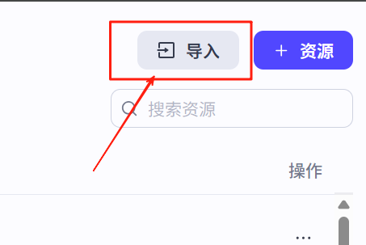
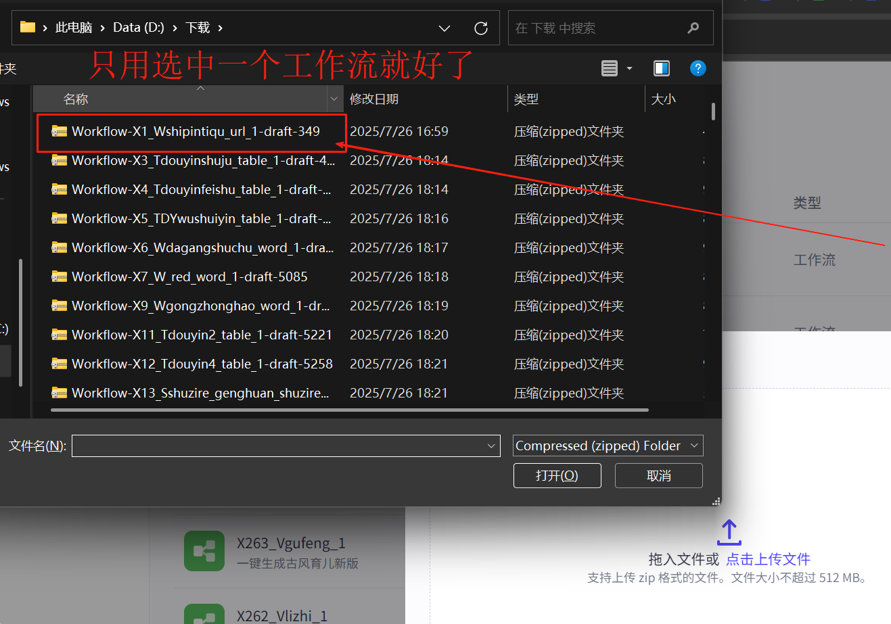
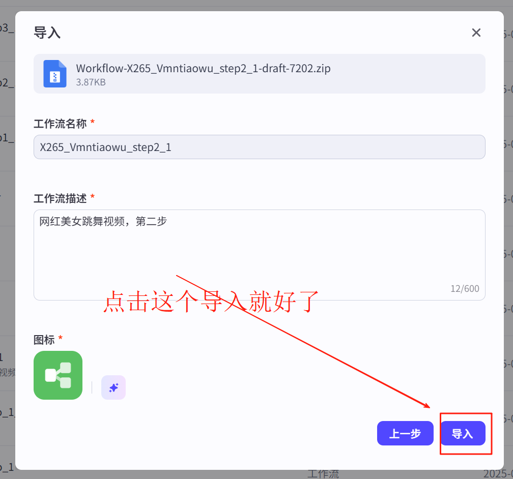
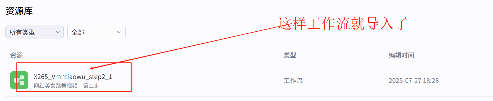

# AI工作流集合

## 🔧 使用说明

本指南将引导您如何获取本项目的工作流文件，并将其成功导入到您的 [Coze](https://www.coze.cn/) 平台。

---

### 第一步：获取工作流文件

我们提供两种方法来获取所有工作流文件，请根据您的熟悉程度选择其一。

#### 方法一：使用 Git (推荐)

如果您熟悉 Git，这是最快捷的方法。打开您的终端或命令行工具，运行以下命令克隆本仓库到本地：

```bash
git clone https://github.com/xdimtech/coze-workflow-example.git
```

### 第二步：在 Coze 中导入工作流

获取文件后，请按照以下步骤将其导入 Coze：

1.  登录 [Coze 官网](https://www.coze.cn/space)，进入您的个人空间，在左侧菜单中选择 **“资源库”**。

    <p align="center">
      
    </p>

2.  点击页面右上角的 **“导入”** 按钮。

    <p align="center">
      
    </p>

3.  在弹出的窗口中，点击 **“上传文件”**，然后找到并选择您在第一步中获取的任意一个工作流 `.json` 文件。

    <p align="center">
      
    </p>

4.  文件上传后，确认信息无误，点击右下角的 **“导入”** 按钮。

    <p align="center">
      
    </p>

5.  导入成功！您会在右下角看到成功提示，并且新的工作流已经出现在您的资源库列表中。

    <p align="center">
      
    </p>

恭喜！您已成功导入工作流，现在可以在您的 Bot 中尽情使用它了。


## 🚀 工作流完整列表

| 序号 | 类型 | 名称 | 简介 |
| :--- | :--- | :--- | :--- |
| 1 | 文档 | `X1_Wshipintiqu_url` | 提取无水印视频：抖音、小红书、B站、快手 无水印批量提取视频 |
| 2 | 文档 | `X2_W05_douyinweidu_word_` | 抖音博主全方位维度分析拆解 |
| 3 | 表格 | `X3_Tdouyinshuju_table` | （批量）提取抖音博主数据信息到飞书多维表格 |
| 4 | 表格 | `X4_Tdouyinfeishu_table` | 提取抖音博主主页中视频文案，写入到飞书多维表格 |
| 5 | 表格 | `X5_TDYwushuiyin_table` | 采集抖音博主主页作品的标题、封面、无水印视频等内容保存到飞书多维表格 |
| 6 | 文档 | `X6_Wdagangshuchu_word` | 输入大纲生成长文并输出到飞书文档 |
| 7 | 文档 | `X7_W_red_word` | 提取小红书视频笔记内容进行仿写和润色存入飞书文档 |
| 9 | 文档 | `X9_Wgongzhonghao_word` | 公众号自动发文基础版 |
| 10 | 数字人 | `X10_S01_chanjing_shuziren` | 免费版本禅镜数字人、不扣禅豆 |
| 11 | 表格 | `X11_Tdouyin2_table` | 通过关键词检索抖音相关视频信息，并输出到飞书多维表格 |
| 12 | 表格 | `X12_Tdouyin4_table` | 批量提取抖音视频标题和文案到飞书多维表格 |
| 13 | 数字人 | `X13_Sshuzire_genghuan_shuziren` | 飞影数字人工作流，支持更换数字人和声音 |
| 14 | 文档 | `X14_W_tiqujiucuo_word` | 提取视频文案、纠错后保存到飞书文档 |
| 15 | 视频 | `X15_Vtuiwen_video` | 根据输入的信息批量生成推文和音频 |
| 16 | 文档 | `X16_W_tiquwenzi_word` | 提取小红书图文笔记中图集里面的文字内容 |
| 17 | 文档 | `X17_Wgaixinwenwnan_word` | 输入关键词->搜索热点新闻->优化新闻变口播内容 |
| 18 | 文档 | `X18_W_fenjingjiaoben_word` | 根据文案内容生成分镜脚本 |
| 19 | 表格 | `X19_Tdouyin3_table` | 批量提取抖音视频封面文案到飞书多维表格 |
| 20 | 表格 | `X20_Tred2_table` | 批量提取小红书视频文案和详情描述存入飞书多维表格 |
| 21 | 文档 | `X21_Tredbook_table` | 提取小红书视频笔记内容进行仿写和润色存入飞书文档 |
| 22 | 表格 | `X22_T_piliang2_table` | 批量提取视频 黄金开头、结尾钩子、常用短语 存入飞书多维表格 |
| 23 | 表格 | `X23_Tpiliang_table` | 批量提取文案->润色->写标题->配音->输出到飞书多维表格 |
| 24 | 图片 | `X24_Vxhsyangsheng_video` | 一键生成小红书养生赛道图文 |
| 25 | 图片 | `X26_Wbaogao_word` | 根据图表生成分析报告 |
| 26 | 图片 | `X27_Wzaixianjianli_word` | 输入文件和内容生成在线简历 |
| 27 | 图片 | `X28_W27zaixianjianli_word` | 输入要修改的在线简历链接和内容再次生成在线简历 |
| 28 | 图片 | `X29_Wzaixianjianli_word` | 一键生成在线简历 |
| 29 | 视频 | `X38_V19_shudan_video` | 书单号视频工作流 |
| 30 | 图片 | `X39_Pxiaonvhaiyulu_picture` | 批量生成治愈小女孩语录 |
| 31 | 视频 | `X40_Vrenshisiwei_video` | 认识思维视频一件生成工作流 |
| 32 | 视频 | `X41_V1zhiyuyulu_video` | 一键生成治愈语录视频工作流 |
| 33 | 图片 | `X43_Vfanyeshudan_video` | 抖音翻页书单号 |
| 34 | 图片 | `X44_Pyingyu_picture` | 英语单词卡片 |
| 35 | 图片 | `X45_Pribao_picture` | AI日报工作流 |
| 36 | 图片 | `X46_Pgengtu_picture` | 批量生成关羽梗图 |
| 37 | 图片 | `X47_Pzhiyu_picture` | 批量生成治愈老爷爷图片 |
| 38 | 图片 | `X48_P01zimeititushu_picture` | 自媒体读书博主图书推荐工作流 |
| 39 | 视频 | `X51_Viconxinlixue2_video` | 批量做icon风心理学视频工作流 |
| 40 | 视频 | `X51_Vziyinpin1_video` | 子工作流：分割文案，生成音频、并获取音频时长 |
| 41 | 视频 | `X52_Vshuimo_video` | 一键生成情感类国风水墨风格视频（版本一） |
| 42 | 视频 | `X53_Vyangsheng_video` | 养生视频 |
| 43 | 视频 | `X55_Vzidingyilaoyeye_video` | 文案可自定义版本的治愈系老爷爷视频 |
| 44 | 视频 | `X56_Pipadushu_video` | 生成《三分钟精读一本书》视频 |
| 45 | 视频 | `X57_kadianshudan_video` | 输入文案或者书名和作者名，生成爆款卡点书单视频 |
| 46 | 音乐 | `X58_suno_gen_mp3_71_1` | suno音乐生成案例 |
| 47 | 视频 | `X58_suno_gen_mp3_71_2` | 输入生成返回的data 任务ID。然后去查询结果。 |
| 48 | 视频 | `X59_Vbaokuanshudan_video` | 书单 | 爆款书单一键生成（翻页版） |
| 49 | 视频 | `X63_Plaorenzhiyu_picture` | 聚焦为老人创作治愈艺术（插画） |
| 50 | 视频 | `X65_videoyingyu_video` | 每日英语1 |
| 51 | 视频 | `X66_shudananhei_video` | 书单视频-铅笔画风格 |
| 52 | 视频 | `X70_Vshuangrenxinlixue_video` | 双人心理学视频,可自定义内容和音频 |
| 53 | 视频 | `X72_Vminjiangushi_video` | 民间故事视频生成 |
| 54 | 视频 | `X74_Wcaisehuochairen_video` | 用于生成火柴人风格的心理学视频彩色版 |
| 55 | 视频 | `X75_V3fenzhongshudan_video` | 三分钟读一本书，输入作者名称，书籍名称 |
| 56 | 图片 | `X76_Vyuerhuiben_video` | 育儿绘本故事视频生成 |
| 57 | 图片 | `X77_Ptupianzhuangif_picture` | 上传图片生成 gif |
| 58 | 视频 | `X78_Pjierihaibao_picture` | 更加节日自动生成海报 |
| 59 | 视频 | `X79_Vzhutishipin_video` | 主题词生成视频 |
| 60 | 视频 | `X80_Vzhutishengshipin_video` | 输入主题，自动混剪视频 |
| 61 | 视频 | `X81_Vguoxueshipin_video` | 国学图文视频生成 |
| 62 | 视频 | `X85_Vyuershuji_video` | 育儿书籍 |
| 63 | 视频 | `X86_Vxiangsufeng_video` | 一键生成像素风视频 |
| 64 | 视频 | `X88_Vyuer_video` | 一键生成育儿哄睡绘图视频 |
| 65 | 视频 | `X90_Vshudan_video` | 一键生成书单爆款种草视频 |
| 66 | 视频 | `X91_Vertonghongshui_video` | 一键生成儿童哄睡视频 |
| 67 | 图片 | `X93_Vdanci1_video` | 一键生成背单词视频 |
| 68 | 表格 | `X94_Pshuji_picture` | 用户输入书籍名称后，自动调用该工作流生成图片 |
| 69 | 表格 | `X95_T01red1_table` | 通过关键词检索小红书相关笔记信息，并输出到飞书多维表格 |
| 70 | 视频 | `X96_Vlaohuangli_video` | 老黄历视频生成（钦天监同款） |
| 71 | 视频 | `X97_Vgecishiping_video` | 一键生成歌词视频 |
| 72 | 视频 | `X98_Vqingganzhiyu_video` | 一键生成不同背景的情感治愈小视频 |
| 73 | 视频 | `X99_Vyuerhuiben_pro_video` | 育儿绘本动态视频 第一步 |
| 74 | 视频 | `X100_Vyuerhuibenpro_step2video` | 育儿绘本动态视频 第二步 |
| 75 | 视频 | `X101_Vyuerhuibenpro_step3video` | 育儿绘本动态视频 第三步 |
| 76 | 视频 | `X102_Vxiangsubianqingxi_step1` | 像素变清晰 第一步 |
| 77 | 视频 | `X103_Vxiangsubianqingxi_step2` | 像素变清晰 第二步 |
| 78 | 视频 | `X104_Vxiangsubianqingxi_step3` | 像素变清晰 第三步 |
| 79 | 视频 | `X105_V54xiangsufeng_video` | 一键生成像素风视频 |
| 80 | 视频 | `X106_xiangsufeng_jimeng_step1` | 像素风-即梦版本 第一步 |
| 81 | 视频 | `X107_xiangsufeng_jimeng_step2` | 像素风-即梦版本 第二步 |
| 82 | 视频 | `X108_xiangsufeng_jimeng_step3` | 像素风 即梦版本 第三步 |
| 83 | 视频 | `X109_Vlaohuangli_pro_video` | 一键生成老黄历升级版 |
| 84 | 视频 | `X110_Vdaojiaoxuanxue_video` | 一键生成道教玄学视频 |
| 85 | 视频 | `X111_wordstudy_new_video` | 一键生成背单词视频（新版本） |
| 86 | 视频 | `X112_Vxioarenguo_01_video` | 小人国第一步 |
| 87 | 视频 | `X113_Vxioarenguo_02_video` | 小人国第二步 |
| 88 | 视频 | `X114_Vxioarenguo_03_video` | 小人国第三步 |
| 89 | 视频 | `X115_Vshicaizouxiu01_provideo` | 食材走秀01：生成,提交任务到等待狗 |
| 90 | 视频 | `X116_Vshicaizouxiu02_provideo` | 食材走秀02：异步,循环查询任务状态 |
| 91 | 视频 | `X117_Vshicaizouxiu03_provideo` | 食材走秀03：草稿合成 |
| 92 | 视频 | `X118_Vyuer_sp_step1_58video` | 古风育儿经视频——豆包图生视频第一步 |
| 93 | 视频 | `X119_Vyuer_sp_step2_58video` | 古风育儿经视频——豆包图生视频第二步 |
| 94 | 视频 | `X120_Vyuer_sp_step3_58video` | 古风育儿经视频——豆包图生视频第三步 |
| 95 | 视频 | `X121_gufengshuimo_57video` | 输入抖音链接，提取文案生成古风水墨视频 |
| 96 | 视频 | `X122_Vgushici_pro_max_v3_43` | 古诗词视频生成，豆包 |
| 97 | 视频 | `X123_gushiprov2_asyn_pro_video` | 循环查询豆包任务状态 |
| 98 | 视频 | `X124_gushiprov2_pro_video` | 合成草稿——第三步 |
| 99 | 视频 | `X125_children_to_leep_video` | 一键生成儿童哄睡视频 |
| 100 | 视频 | `X126_gangqing_video` | 一键生成感情治愈视频 |
| 101 | 视频 | `X127_Vlegen_buzhou_video` | 输入名字生成历史人物视频第一步 |
| 102 | 视频 | `X128_Vlegen_buzhou2_video` | 历史人物第二步 |
| 103 | 视频 | `X129_Vlegen_buzhou3_video` | 历史人物第三步 |
| 104 | 视频 | `X130_Vjybgm_url_1` | 剪映背景音乐案例 |
| 105 | 视频 | `X131_Vjy_draft_09_1596` | 剪映操作，特效添加案例。 |
| 106 | 视频 | `X132_Vjy_draft_10_1597` | 背景音乐和音效 |
| 107 | 视频 | `X133_Vjy_sound_url_2_1596` | 剪映音效添加案例 |
| 108 | 视频 | `X134_Vjy_sticker_demo_1595` | 剪映贴纸操作。 |
| 109 | 视频 | `X135_Vxingzuo_1_video` | 一键生成十二星座治愈视频 |
| 110 | 视频 | `X136_Vjy_draft_07_1569` | 视频素材添加到剪映 |
| 111 | 视频 | `X137_Vjy_draft_08_1569` | 剪映处理时间线生成案例 |
| 112 | 视频 | `X138_Vjy_draft_05_1569` | 关键帧的制作 |
| 113 | 视频 | `X139_Vjy_draft_06_1569` | 音频到剪映:长音频，短音频，bmg音乐。声音特效。 |
| 114 | 视频 | `X140_jy_draft_01_1808` | 剪映操作01 快速素材到剪映 |
| 115 | 视频 | `X141_Vjy_draft_02_1807` | 剪映操作02 添加字幕 |
| 116 | 视频 | `X142_Vjy_draft_03_1807` | 剪映操作03，重点词到剪映 |
| 117 | 视频 | `X143_Vjy_draft_04_1808` | 图片到剪映，带转场 |
| 118 | 视频 | `X144_Vdraft_03_01_1806` | 重点词到剪映，带图片 |
| 119 | 表格 | `X145_Ttable_demo_01_1281` | 云多维表格使用案例，可以替代飞书多维表格，支持快速批量写入，预览 |
| 120 | 表格 | `X146_Tgen_vt_fenxi_437` | 图表分析报告 |
| 121 | 表格 | `X147_T_URL_to_script_2_32_405` | URL转换成视频分镜脚本 |
| 122 | 声音克隆 | `X148_Vvoice_clone_489` | 声音克隆 |
| 123 | 视频 | `X149_Vyuer_sp_step1_18` | 古风育儿经视频——第一步 |
| 124 | 视频 | `X150_Vyuer_sp_step2_18` | 古风育儿经视频——第二步 |
| 125 | 视频 | `X151_Vyuer_sp_step3_18` | 古风育儿视频——第三步 |
| 126 | 图片 | `X152_Pcut_video_img_370` | 将视频按时间截取为图片帧 |
| 127 | 视频 | `X153_Vvidu_video_450` | vidu图生视频 |
| 128 | 视频 | `X154_Vvidu_video_task_info_449` | vidu图生视频，查询结果 |
| 129 | 图片 | `X155_Pcontent2img_427picture` | 视频标题封面生成器 |
| 130 | 图片 | `X156_Pwx_2_img_427picture` | 从公众号获取内容，然后生成大图 |
| 131 | 视频 | `X157_Vcharacter_consistency` | 人物一致性 |
| 132 | 视频 | `X158_Vgushici_pro_v2_gen_video` | 古诗合并成剪映草稿的方法。 |
| 133 | 视频 | `X159_Vgushi_pro_v2_video_asyn` | 古诗任务ID同步 |
| 134 | 视频 | `X160_Vgushi_pro_v2_video` | 古诗词视频生成 |
| 135 | 视频 | `X161_Vshicaizouxiu01_create_1` | 食材走秀01：生成，提交任务到等待狗 |
| 136 | 视频 | `X162_Vshicaizouxiu02_check_` | 食材走秀02：异步，循环查询任务状态 |
| 137 | 视频 | `X163_Vshicaizouxiu03_draft_2` | 食材走秀03：草稿合成 |
| 138 | 视频 | `X164_gushi_pro_v2_video` | 古诗任务ID同步 |
| 139 | 视频 | `X165_gushici_pro_v2_gen_video` | 古诗合并成剪映草稿的方法。 |
| 140 | 视频 | `X166_Vgushici_pro_v3` | 古诗词视频生成，即梦 |
| 141 | 表格 | `X167_Ttaobao_data_421` | 淘宝商品数据的获取方式。输入淘宝链接提取商品大图，详情等数据。 |
| 142 | 图片 | `X168_upload_img_370` | 上传文件 |
| 143 | 视频 | `X169_jy_text_anli_01_401` | 文字字幕视频制作 |
| 144 | 图片 | `X170_Pexpression_440_picture` | 表情包生成器，支持角色固定，文案固定，数量固定，可随机可固定，存储历史数据 |
| 145 | 视频 | `X171_VAkonggu_video` | A股公司教学视频 |
| 146 | 音乐 | `X173_Mbg_audio_music` | 一键获取背景音乐 |
| 147 | 图片 | `X174_Pnutrition_picture` | 输入菜品或者拍照能输出营养分析报告卡片。 |
| 148 | 图片 | `X175_Pupdate_img_all` | 批量上传图片 |
| 149 | 文档 | `X176_Wgaixie_word` | 输入关键词-搜索热点新闻-优化新闻变口播内容。Deepseek + Coze + 飞书,批量二创网络热搜口播文案 |
| 150 | 图片 | `X177_P_updata_img_picture` | 单个上传图片（图片变链接） |
| 151 | 文档 | `X178_S_search_2_buy_407` | 某鱼二手回收搜索。 |
| 152 | 视频 | `X179_V_img_2_video` | 海螺转视频。 |
| 153 | 视频 | `X180_V_img_2_video_get` | 获取图生视频的结果。 |
| 154 | 图片 | `X181_P_caipin_427` | 输入菜品，生成制作方法卡片 |
| 155 | 图片 | `X182_P_zhishi_card_599` | 知识卡片 |
| 156 | 表格 | `X183_URL_to_script_2_589` | URL转换成视频分镜脚本 |
| 158 | 视频 | `X184_removebg_499` | 删除背景 |
| 159 | 文案 | `X185_W_get_dy_srt_2_word` | 抖音文案-音频版本-适合长视频提取。 |
| 160 | 文案 | `X186_W_get_dy_srt_word` | 抖音文案-短视频获取 |
| 161 | 视频 | `X187_V_nainai_video_594` | 治愈奶奶工作流 |
| 162 | 视频 | `X188_W_mingyanSinology_video` | 【代码版】名言名句文案视频制作 |
| 163 | 文档 | `X189_Wys_text_` | 生成养身类文本 |
| 164 | 视频 | `X190_Vys_video` | 根据养身文本生成视频 |
| 165 | 视频 | `X191_mingyanSinologynot_video` | 【无代码版】名言名句文案视频制作 |
| 166 | 图片 | `X192_jobjianli_online_picture` | 生成在线简历 |
| 167 | 文档 | `X193_P_gen_job_online_by_file` | 输入文件和内容生成在线简历 |
| 168 | 文档 | `X194_P_gen_job_online_imgs` | 输入图片和内容生成在线简历 |
| 169 | 文档 | `X195_gen_job_online_by_url` | 输入要修改的在线简历链接和内容再次生成在线简历 |
| 170 | 视频 | `X196_Vguoming_qinggan_video` | 一键生成情感类国风水墨风格视频（版本二） |
| 171 | 视频 | `X197_M_video2mp3_` | 提取视频中的音频 |
| 172 | 文档 | `X198_W_xhs_get_img` | 小红书图文笔记的内容，可以获取图集，还有图集里面的文字内容 |
| 173 | 文档 | `X199_W_xhs_get_user_note` | 根据小红书主页获取小红书用户笔记 |
| 174 | 文档 | `X200_W_xhs_get_user_note_mul` | 多页自动提取，根据小红书主页获取小红书用户笔记 |
| 175 | 表格 | `X_201_xhs_get_user_note_excel` | 多页自动提取，根据小红书主页获取小红书用户笔记，然后导出到表格。 |
| 176 | 表格 | `X202_T_super_table_demo` | 超级表格的用户案例，可以把列表内容直接转化成可视化表格。还能导出Excel表格。 |
| 177 | 视频 | `X203_V_children_song_video` | 一键生成启蒙儿歌视频 |
| 178 | 文档 | `X204_V_down_video` | 全网视频无水印下载【b站、抖音、快手等】 |
| 179 | 视频 | `X205_V_donghua_word_video` | 激励文案视频制作 |
| 180 | 视频 | `X206_V_danciword_video` | 剪映单词思维导图视频制作 |
| 181 | 视频 | `X207_V_captions_video` | 剪映案例，字幕视频制作。 |
| 182 | 视频 | `X208_Vcuregrandpa_video` | 治愈系老爷爷视频 |
| 183 | 视频 | `X209_V_YSvideo_yug_video` | 批量做中式养生视频 |
| 184 | 视频 | `X210_video_stick_psy_flow_demo` | 用于生成火柴人风格的心理学视频 |
| 185 | 视频 | `X211_video_stick_psy_flowvideo` | 火柴人-顺序流（左中右3张图），集成了对v2的动态调用 |
| 186 | 视频 | `X212_V_book_video_v3_` | 一键生成书单号视频【翻书特效】 |
| 187 | 视频 | `X213_V_book_video_v1` | 书单短视频,不带背景图，纯文字 |
| 188 | 视频 | `X214_V_book_video_v2_` | 书单短视频,带背景图，打字机音乐 |
| 189 | 视频 | `X215_legen_buzhou1` | 历史人物第一步 |
| 190 | 视频 | `X216_legen_buzhou2` | 第二步 |
| 191 | 视频 | `X217_legen_buzhou3` | 第三步 |
| 192 | 表格 | `X218_T_video_cut_table` | 获取视频的图片列表。 |
| 193 | 图片 | `X219_img_2_video_step_1_` | 第一步生成图片和台词。 |
| 194 | 视频 | `X220_Pimg_2_video_step_2` | 同时图生视频的任务结果。 |
| 195 | 视频 | `X221_img_2_video_step_3_` | 导入剪映小助手合成视频 |
| 196 | 视频 | `X222_img_2_video_step_3_15` | 导入剪映小助手合成视频，带云渲染。 |
| 197 | 视频 | `X223_Vchildren_song_step_1_` | 一键生成启蒙儿歌制作素材，提交图生视频任务。 |
| 198 | 视频 | `X224_Vchildren_song_step_2` | 检测同步图生视频的任务。 |
| 199 | 视频 | `X225_V_children_song_step_3_` | 云表格数据剪辑成视频直接输出云渲染视频 |
| 200 | 视频 | `X226_V_children_song_step_3_` | 云表格数据剪辑成视频。 |
| 201 | 视频 | `X227_V_Lishi_Historical_story` | 一键生成历史故事 |
| 202 | 视频 | `X228_V_ztc_work_guzhu` | 古风育儿经基础版视频 |
| 203 | 视频 | `X229_V_ChildrenMythicalStory` | 儿童卡通神话故事视频 |
| 204 | 视频 | `X230_V_book_can_speak_` | 一键生成假如书籍会说话的视频 |
| 205 | 视频 | `X231_V_shudan_video_pro` | 一键生成书单类视频【高级版】 |
| 206 | 视频 | `X232_V_zhiyu_girl_` | 一键生成治愈女孩独居视频 |
| 207 | 视频 | `X233_V_shudan_anhei_video` | 书单视频-铅笔画风格 |
| 208 | 视频 | `X237_Venglish` | 一键生成每日英语 |
| 209 | 视频 | `X238_Vmeinvtiaowu` | 一键生成美女跳舞视频 |
| 210 | 视频 | `X239_Vchengshijuex` | 一键生成城市觉醒视频 |
| 211 | 视频 | `X240_Voumeikatong` | 欧美卡通3D视频 |
| 212 | 视频 | `X241_Vflux_dianshang` | 生成电商宣传视频 |
| 213 | 视频 | `X242_flux_video` | 生成电商宣传视频 |
| 214 | 视频 | `X243_Vzhexue` | 一键生成哲学类型视频 |
| 215 | 视频 | `X244_Vxiangyan` | 一键生成爆款情感香烟 |
| 216 | 图片 | `X245_Pfluxhecheng` | 一键合并两张图片 |
| 217 | 视频 | `X246_Vluoyan3D` | 一键生成裸眼3D视频 |
| 218 | 视频 | `X247_Vnewxiaorenguo` | 小人国最新版 |
| 219 | 视频 | `X250_Vdongwuyundong` | 生成动物奥运会视频 |
| 220 | 视频 | `X251_Vshangpinxuanchuan` | 输入商品名称生成商品宣传视频 |
| 221 | 视频 | `X252_Vlishirenwu_video` | 一键生成历史人物的一生（一键生成新版） |
| 222 | 视频 | `X253_Vgufengyuer_video` | 一键生成古风育儿（新版） |
| 223 | 视频 | `X254_jinriyulu_video` | 一键生成今日语录 |
| 224 | 视频 | `X256_shangpingxuanchuan_video` | 根据提示词生成商品宣传视频 |
| 225 | 视频 | `X257_Vfluxshangpin_video` | 提供产品图片，一键生成电商主图 |
| 226 | 视频 | `X258_Vjumao_video` | 爆款橘猫短视频 |
| 227 | 视频 | `X259_Vlitivguan_Video` | 3d微观立体视频 |
| 228 | 视频 | `X260_Vtianyuan_video` | 生成田园治愈风格视频 |
| 229 | 视频 | `X261_Vlishihongshui` | 一键生成爆款超长历史哄睡视频 |
| 230 | 视频 | `X262_Vlizhi` | 生成励志爆款短视频 |
| 231 | 视频 | `X263_Vgufeng` | 一键生成古风育儿新版 |
| 232 | 视频 | `X264_Vdiyirencheng` | 第一人称体验工作流 |
| 233 | 视频 | `X265_Vmntiaowu` | 网红美女跳舞 |
| 234 | 视频 | `X266_Vdujunvhai` | 独居治愈女孩VLOG新版 |
| 235 | 视频 | `X267_Vmiaobi` | 妙笔生花微观视频 |
